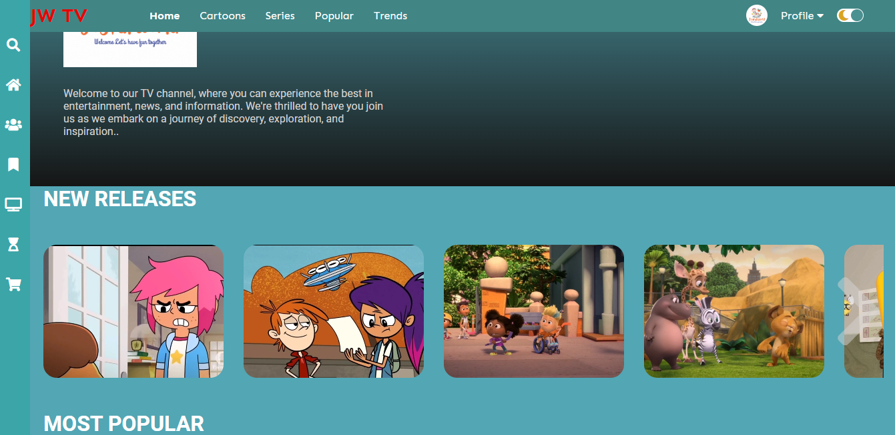

 

This repository is a cartoon website, your go-to destination for all things animated! Here, you'll find a vast collection of cartoons, including popular TV shows, movies, and web series, as well as new and emerging content.

Our website offers something for everyone, with cartoons in various genres, including comedy, action, adventure, drama, and more. Whether you're looking for a laugh or an epic adventure, you're sure to find something that will keep you entertained for hours.

In addition to our extensive library of cartoons, we also offer other fun features, such as games, puzzles, and coloring pages related to the shows. These activities are designed to keep our younger viewers engaged and learning while they have fun.

We pride ourselves on being a safe and family-friendly website, which is why we take great care in selecting the content we offer. Our cartoons are appropriate for all ages, and parents can feel confident that their children are in a safe online environment.

We also believe in community building, which is why we encourage our users to create profiles, rate content, and leave comments. This way, you can interact with other cartoon enthusiasts, share your opinions, and discover new shows together.

AUTHOR: Annah Nokutheza Mwanza
